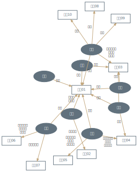

# 使用Graphviz和Python脚本绘制企业股权结构图  

Author: Yanyu Long  
Updated: Mar 21, 2021

**注意事项**  

Graphviz是一个可视化图形软件，非Python自带，需提前安装，安装后将Graphviz的bin子目录加入系统环境变量。  

> 若Graphviz的安装目录为`C:\Program Files\Graphviz2.38`，需将`C:\Program Files\Graphviz2.38\bin`加到系统环境变量列表中。

**Tips**  

生成的股权结构图保存为svg后可以复制到Visio里进行微调美化。从Visio复制到Word，粘贴为图片，清晰度会很高。


```python
import pandas as pd
import numpy as np
from graphviz import Digraph # Digraph - 有向图，Graph - 无向图
import os
import re
```

**辅助函数：生成渐变色**  

* 参考：https://blog.csdn.net/sinat_37967865/article/details/93203689
* 使用方式：

```
hex2rgb("#30475e") # -> [48, 71, 94]
rgb2hex([48, 71, 94]) # -> '#30475E'
```


```python
def rgb2hex(rgb):
    color = '#'
    for num in rgb:
        num = int(num)
        color += str(hex(num))[-2:].replace('x', '0').upper()
    return color

def hex2rgb(hex):
    r = int(hex[1:3],16)
    g = int(hex[3:5],16)
    b = int(hex[5:7], 16)
    rgb = [r,g,b]
    return rgb
```

## 企业股权结构图

### 案例1：虚拟数据


```python
data = pd.read_excel("./对外投资.xlsx", sheet_name = "对外投资(多级)").drop_duplicates().reset_index(drop = True)
data
```


<div>
<style scoped>
    .dataframe tbody tr th:only-of-type {
        vertical-align: middle;
    }

    .dataframe tbody tr th {
        vertical-align: top;
    }

    .dataframe thead th {
        text-align: right;
    }
</style>
<table border="1" class="dataframe">
  <thead>
    <tr style="text-align: right;">
      <th></th>
      <th>企业名称</th>
      <th>投资企业</th>
      <th>出资比例</th>
    </tr>
  </thead>
  <tbody>
    <tr>
      <th>0</th>
      <td>企业A</td>
      <td>企业E</td>
      <td>9.642857</td>
    </tr>
    <tr>
      <th>1</th>
      <td>企业B</td>
      <td>企业F</td>
      <td>52.173913</td>
    </tr>
    <tr>
      <th>2</th>
      <td>企业A</td>
      <td>企业B</td>
      <td>50.761421</td>
    </tr>
    <tr>
      <th>3</th>
      <td>企业C</td>
      <td>企业G</td>
      <td>50.000000</td>
    </tr>
    <tr>
      <th>4</th>
      <td>企业D</td>
      <td>企业H</td>
      <td>5.681818</td>
    </tr>
    <tr>
      <th>5</th>
      <td>企业D</td>
      <td>企业I</td>
      <td>5.000003</td>
    </tr>
    <tr>
      <th>6</th>
      <td>企业E</td>
      <td>企业J</td>
      <td>48.571429</td>
    </tr>
    <tr>
      <th>7</th>
      <td>企业E</td>
      <td>企业F</td>
      <td>47.826087</td>
    </tr>
    <tr>
      <th>8</th>
      <td>企业D</td>
      <td>企业K</td>
      <td>20.000000</td>
    </tr>
    <tr>
      <th>9</th>
      <td>企业D</td>
      <td>企业L</td>
      <td>2.000000</td>
    </tr>
    <tr>
      <th>10</th>
      <td>企业A</td>
      <td>企业D</td>
      <td>16.666667</td>
    </tr>
    <tr>
      <th>11</th>
      <td>企业A</td>
      <td>企业C</td>
      <td>100.000000</td>
    </tr>
    <tr>
      <th>12</th>
      <td>企业C</td>
      <td>企业M</td>
      <td>100.000000</td>
    </tr>
  </tbody>
</table>
</div>


```python
# 计算各节点（企业）深度 -------------------------------------
var_firma = "企业名称"; var_firmb = "投资企业"; var_rate = "出资比例"
df_firm = pd.DataFrame(columns = ["name", "depth", "id"])
df_firm.name = list(set(data[var_firma]).union(set(data[var_firmb])))
df_firm.id = np.arange(0, len(df_firm.name))

firm_list_0 = list(set(data[var_firma]).difference(set(data[var_firmb])))
d = 0 
while len(firm_list_0)>0:
        df_firm.loc[df_firm.name.isin(firm_list_0), "depth"] = d
        d += 1
        firm_list_1 = []
        for firm in firm_list_0:
            firm_list_1 += data.loc[data[var_firma] == firm, var_firmb].tolist()
        firm_list_0 = firm_list_1    

if "depth" not in data.columns:
    data = pd.merge(data, df_firm, left_on = "企业名称", right_on = "name", how="left")
data = data.sort_values(by="depth").reset_index(drop = True)
data[["name", "id", "depth"]].drop_duplicates().sort_values(by = "depth").head(10)
```


<div>
<style scoped>
    .dataframe tbody tr th:only-of-type {
        vertical-align: middle;
    }

    .dataframe tbody tr th {
        vertical-align: top;
    }

    .dataframe thead th {
        text-align: right;
    }
</style>
<table border="1" class="dataframe">
  <thead>
    <tr style="text-align: right;">
      <th></th>
      <th>name</th>
      <th>id</th>
      <th>depth</th>
    </tr>
  </thead>
  <tbody>
    <tr>
      <th>0</th>
      <td>企业A</td>
      <td>3</td>
      <td>0</td>
    </tr>
    <tr>
      <th>4</th>
      <td>企业B</td>
      <td>8</td>
      <td>1</td>
    </tr>
    <tr>
      <th>5</th>
      <td>企业C</td>
      <td>6</td>
      <td>1</td>
    </tr>
    <tr>
      <th>6</th>
      <td>企业D</td>
      <td>1</td>
      <td>1</td>
    </tr>
    <tr>
      <th>8</th>
      <td>企业E</td>
      <td>9</td>
      <td>1</td>
    </tr>
  </tbody>
</table>
</div>


```python
# 设定各节点（企业）颜色为按深度递减的渐变色 -------------------------------------------------
n_level = df_firm.depth.max()
col1 = [34, 50, 66]; col2 = [160, 177, 184]
df_rgb = pd.DataFrame(columns = ['r', 'g', 'b'])
df_rgb.r = np.arange(col1[0], col2[0]+1, (col2[0]-col1[0])/n_level)
df_rgb.g = np.arange(col1[1], col2[1]+1, (col2[1]-col1[1])/n_level)
df_rgb.b = np.arange(col1[2], col2[2]+1, (col2[2]-col1[2])/n_level)
col_list = [rgb2hex(df_rgb.iloc[idx].tolist()) for idx in range(len(df_rgb))]
col_dict = {}
for idx, col in enumerate(col_list):
    col_dict[idx] = col
col_dict
```


    {0: '#223242', 1: '#61717D', 2: '#A0B1B8'}


```python
g = Digraph(
    name="股权结构图", 
    node_attr={
        "shape": "box", 
        "style": "filled", "fontcolor": "#ffffff",
        "fontname": "STZhongsong", "fontsize": "7", 
        "height":"0.25", "width":".35",  # 多行
    }, 
    edge_attr={
        "fontname": "STZhongsong",
        "fontsize":"6",
        "arrowsize":".5",
    },
    format="svg",
)
g.attr(
    nodesep='0.05',
    ranksep='.3',
    margin='0',
)

for idx in range(len(data)):
    firm_a = data.loc[idx, var_firma]
    id_a = df_firm.loc[df_firm.name == firm_a, "id"].tolist()[0]
    depth_a = df_firm.loc[df_firm.name == firm_a, "depth"].tolist()[0]
    firm_b = data.loc[idx, var_firmb]
    rate = data.loc[idx, var_rate]
    g.node(str(id_a), label=firm_a,
           color = "#61717d", fillcolor = "#61717d")
    if rate>=0:
        id_b = df_firm.loc[df_firm.name == firm_b, "id"].tolist()[0]
        depth_b = df_firm.loc[df_firm.name == firm_b, "depth"].tolist()[0]
        g.node(str(id_b), label=firm_b,
               color = "#61717d", fillcolor = "#61717d")
        g.edge(str(id_a), str(id_b), label = f"{round(rate,1)}%", color="#c1a57b")

g.view(filename="股权结构图", directory="./")
```


    '.\\股权结构图.svg'


### 案例2：上饶投资


```python
data = pd.read_excel("./上饶投资控股集团有限公司.xlsx", sheet_name = "旅游").drop_duplicates().reset_index(drop = True)
data.head(10)

# 计算各节点（企业）深度 -------------------------------------
var_firma = "企业名称"; var_firmb = "投资企业"; var_rate = "出资比例"    
df_firm = pd.DataFrame(columns = ["name", "depth", "id"])
df_firm.name = list(set(data[var_firma]).union(set(data[var_firmb])))
df_firm.id = np.arange(0, len(df_firm.name))

firm_list_0 = list(set(data[var_firma]).difference(set(data[var_firmb])))
d = 0 
while len(firm_list_0)>0:
    df_firm.loc[df_firm.name.isin(firm_list_0), "depth"] = d
    d += 1
    firm_list_1 = []
    for firm in firm_list_0:
        firm_list_1 += data.loc[data[var_firma] == firm, var_firmb].tolist()
    firm_list_0 = firm_list_1    

if "depth" not in data.columns:
    data = pd.merge(data, df_firm, left_on = var_firmb, right_on = "name", how="left")
data = data.sort_values(by="depth").reset_index(drop = True)

# 设定各节点（企业）颜色为按深度递减的渐变色 -------------------------------------------------
n_level = df_firm.depth.max()
col1 = [34, 50, 66]; col2 = [160, 177, 184]
df_rgb = pd.DataFrame(columns = ['r', 'g', 'b'])
df_rgb.r = np.arange(col1[0], col2[0]+1, (col2[0]-col1[0])/n_level)
df_rgb.g = np.arange(col1[1], col2[1]+1, (col2[1]-col1[1])/n_level)
df_rgb.b = np.arange(col1[2], col2[2]+1, (col2[2]-col1[2])/n_level)
col_list = [rgb2hex(df_rgb.iloc[idx].tolist()) for idx in range(len(df_rgb))]
col_dict = {}
for idx, col in enumerate(col_list):
    col_dict[idx] = col
```


<div>
<style scoped>
    .dataframe tbody tr th:only-of-type {
        vertical-align: middle;
    }

    .dataframe tbody tr th {
        vertical-align: top;
    }

    .dataframe thead th {
        text-align: right;
    }
</style>
<table border="1" class="dataframe">
  <thead>
    <tr style="text-align: right;">
      <th></th>
      <th>企业名称</th>
      <th>投资企业</th>
      <th>出资比例</th>
    </tr>
  </thead>
  <tbody>
    <tr>
      <th>0</th>
      <td>上饶投资控股集团有限公司</td>
      <td>上饶市旅游发展集团有限责任公司</td>
      <td>100.000000</td>
    </tr>
    <tr>
      <th>1</th>
      <td>上饶投资控股集团有限公司</td>
      <td>上饶市城市建设投资开发集团有限公司</td>
      <td>100.000000</td>
    </tr>
    <tr>
      <th>2</th>
      <td>上饶市城市建设投资开发集团有限公司</td>
      <td>上饶市龙潭湖投资有限公司</td>
      <td>100.000000</td>
    </tr>
    <tr>
      <th>3</th>
      <td>三清山旅游产业发展集团有限公司</td>
      <td>上饶市三清山物业管理有限责任公司</td>
      <td>99.933333</td>
    </tr>
    <tr>
      <th>4</th>
      <td>上饶市旅游发展集团有限责任公司</td>
      <td>上饶市全域文化旅游股份有限公司</td>
      <td>99.500000</td>
    </tr>
    <tr>
      <th>5</th>
      <td>三清山旅游产业发展集团有限公司</td>
      <td>上饶市三清山水务有限责任公司</td>
      <td>70.000000</td>
    </tr>
    <tr>
      <th>6</th>
      <td>三清山旅游产业发展集团有限公司</td>
      <td>江西三清山索道有限公司</td>
      <td>7.000000</td>
    </tr>
    <tr>
      <th>7</th>
      <td>上饶市旅游发展集团有限责任公司</td>
      <td>三清山旅游产业发展集团有限公司</td>
      <td>51.000000</td>
    </tr>
    <tr>
      <th>8</th>
      <td>三清山旅游产业发展集团有限公司</td>
      <td>上饶市三清山田园牧歌景区发展有限公司</td>
      <td>49.000000</td>
    </tr>
    <tr>
      <th>9</th>
      <td>三清山旅游产业发展集团有限公司</td>
      <td>上饶市印象旅游产业发展有限公司</td>
      <td>40.000000</td>
    </tr>
  </tbody>
</table>
</div>


```python
g = Digraph(
    name="股权结构图-上饶投资", 
    node_attr={
        "shape": "box", 
        "style": "filled", "fontcolor": "#ffffff",
        "fontname": "STZhongsong", "fontsize": "8", 
        "height":"0.15", "width":".25",  # 多行
    }, 
    edge_attr={
        "fontname": "STZhongsong",
        "fontsize":"5",
        "arrowsize":".5",
    },
    format="svg",
)
g.attr(
    rankdir='LR', 
    nodesep='0.05',
    ranksep='.3',
    margin='0',
)

for idx in range(len(data)):
    firm_a = data.loc[idx, var_firma]
    id_a = df_firm.loc[df_firm.name == firm_a, "id"].tolist()[0]
    depth_a = df_firm.loc[df_firm.name == firm_a, "depth"].tolist()[0]
    firm_b = data.loc[idx, var_firmb]
    rate = data.loc[idx, var_rate]
    g.node(str(id_a), label=firm_a,
          color = col_dict[depth_a], fillcolor = col_dict[depth_a])
    if rate>=0:
        id_b = df_firm.loc[df_firm.name == firm_b, "id"].tolist()[0]
        depth_b = df_firm.loc[df_firm.name == firm_b, "depth"].tolist()[0]
        g.node(str(id_b), label=firm_b,
                color = col_dict[depth_b], fillcolor = col_dict[depth_b])
        g.edge(str(id_a), str(id_b), label = f"{round(rate,1)}%", color="#c1a57b")

g.view(filename="股权结构图-上饶投资", directory="./")
```


    '.\\股权结构图-上饶投资.svg'


## 多家企业间高管兼任情况


```python
data = pd.read_excel("./高管兼任.xlsx").drop_duplicates().reset_index(drop = True)
data.head(10)
```


<div>
<style scoped>
    .dataframe tbody tr th:only-of-type {
        vertical-align: middle;
    }

    .dataframe tbody tr th {
        vertical-align: top;
    }

    .dataframe thead th {
        text-align: right;
    }
</style>
<table border="1" class="dataframe">
  <thead>
    <tr style="text-align: right;">
      <th></th>
      <th>姓名</th>
      <th>任职企业</th>
      <th>职务</th>
    </tr>
  </thead>
  <tbody>
    <tr>
      <th>0</th>
      <td>张三</td>
      <td>企业01</td>
      <td>董事长\n总经理</td>
    </tr>
    <tr>
      <th>1</th>
      <td>张三</td>
      <td>企业02</td>
      <td>副董事长</td>
    </tr>
    <tr>
      <th>2</th>
      <td>李四</td>
      <td>企业01</td>
      <td>董事</td>
    </tr>
    <tr>
      <th>3</th>
      <td>李四</td>
      <td>企业03</td>
      <td>监事</td>
    </tr>
    <tr>
      <th>4</th>
      <td>王五</td>
      <td>企业01</td>
      <td>董事</td>
    </tr>
    <tr>
      <th>5</th>
      <td>王五</td>
      <td>企业04</td>
      <td>法定代表人\n总经理\n执行董事</td>
    </tr>
    <tr>
      <th>6</th>
      <td>王五</td>
      <td>企业05</td>
      <td>法定代表人\n总经理\n执行董事</td>
    </tr>
    <tr>
      <th>7</th>
      <td>宋六</td>
      <td>企业01</td>
      <td>监事</td>
    </tr>
    <tr>
      <th>8</th>
      <td>刘甲</td>
      <td>企业01</td>
      <td>监事</td>
    </tr>
    <tr>
      <th>9</th>
      <td>刘甲</td>
      <td>企业03</td>
      <td>监事</td>
    </tr>
  </tbody>
</table>
</div>


```python
var_firma = "姓名"; var_firmb = "任职企业"; var_rate = "职务"
g = Digraph(
    name="高管兼任", 
    engine='fdp', 
    node_attr={
        "shape": "box", 
        "style": "filled", "fontcolor": "#ffffff",
        "fontname": "STZhongsong", "fontsize": "7", 
        "height":"0.25", "width":".35",  # 多行
    }, 
    edge_attr={
        "fontname": "STZhongsong",
        "fontsize":"6",
        "arrowsize":".5",
    },
    format="svg",
)
g.attr(
    nodesep='0.05',
    ranksep='.3',
    margin='0',
)

for idx in range(len(data)):
    firm_a = data.loc[idx, var_firma]
    id_a = firm_a
    firm_b = data.loc[idx, var_firmb]
    pos = data.loc[idx, var_rate]
    g.node(str(id_a), shape="ellipse", label=firm_a,
           color = "#61717d", fillcolor = "#61717d")
    if True:
        id_b = firm_b
        g.node(str(id_b), label=firm_b,
               color = "#61717d", fillcolor = "#ffffff", fontcolor="#61717d")
        g.edge(str(id_a), str(id_b), label = pos, color="#c1a57b")

g.view(filename="高管兼任", directory="./")
```


    '.\\高管兼任.svg'




## References  

**Graphviz Help Files:**  

* [Graphviz official documents](https://graphviz.readthedocs.io/en/stable/manual.html)
* The basics: https://blog.csdn.net/qq_35603331/java/article/details/81591949  
* Shape settings: https://blog.csdn.net/junruitian/article/details/79596318?utm_source=blogkpcl8  
* Including Chinese characters in Graphviz diagrams: https://blog.csdn.net/maillibin/article/details/100581857  
* More settings: https://www.cnblogs.com/Zzbj/p/11431015.html  
