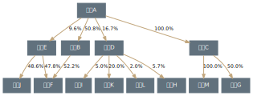
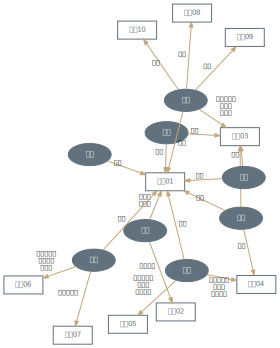
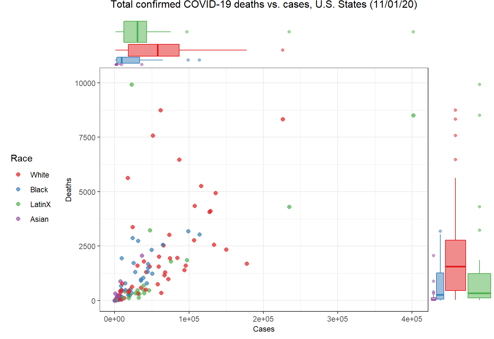
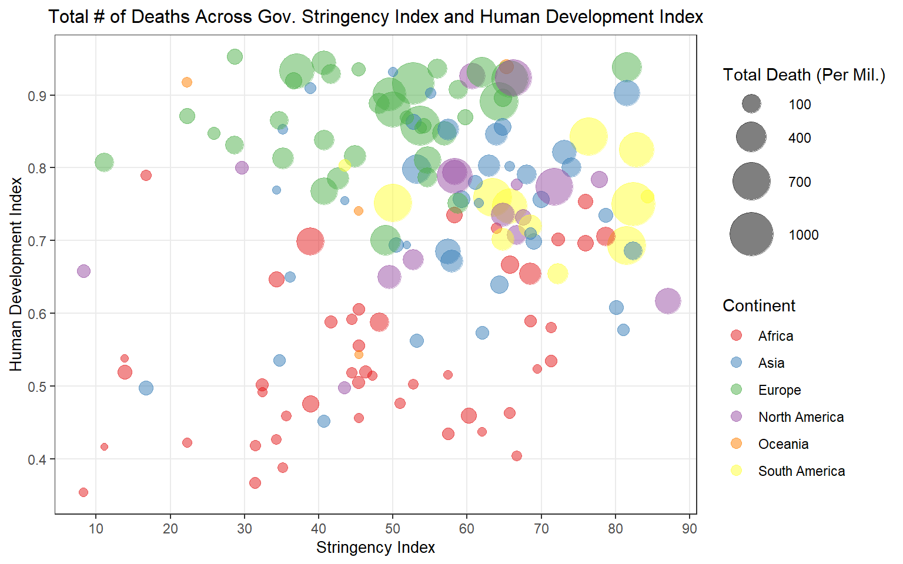

# Data visualization portfolio  

---

## Using Graphviz to automatically create companies' ownership structure diagrams  

* [Tutorial](https://github.com/longyyu/dataviz-portfolio/tree/main/Graphviz)  

---

## Using R's `ggplot2` and `magick` packages to create animated heatmaps

* [Tutorial](https://github.com/longyyu/dataviz-portfolio/tree/main/animated-heatmap)

---

## Data visualization of COVID-19 data using R, STATA, Python, and MATLAB

* Tutorial [preview](https://raw.githack.com/SkyWang0919/STATS-506-Midterm-Project-02/main/Group%202%20Tutorial%20Draft.html), [repository](https://github.com/SkyWang0919/STATS-506-Midterm-Project-02)  

