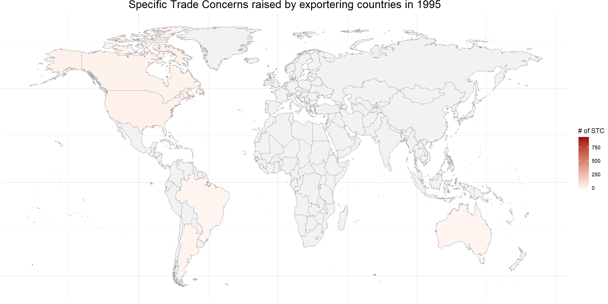

-   [Step 1: Prepare the world map
    data](#step-1-prepare-the-world-map-data)
-   [Step 2: Prepare the numeric values you want to
    plot](#step-2-prepare-the-numeric-values-you-want-to-plot)
-   [Step 3: Start plotting!](#step-3-start-plotting)
-   [Step 4: Link the separate frames and make a
    GIF!](#step-4-link-the-separate-frames-and-make-a-gif)

    library(tidyverse)

## Step 1: Prepare the world map data

    mapWLD = ggplot2::map_data("world")
    mapWLD %>% head()

<table class="table table-striped" style="width: auto !important; margin-left: auto; margin-right: auto;">
<thead>
<tr>
<th style="text-align:right;">
long
</th>
<th style="text-align:right;">
lat
</th>
<th style="text-align:right;">
group
</th>
<th style="text-align:right;">
order
</th>
<th style="text-align:left;">
region
</th>
<th style="text-align:left;">
subregion
</th>
</tr>
</thead>
<tbody>
<tr>
<td style="text-align:right;">
-69.89912
</td>
<td style="text-align:right;">
12.45200
</td>
<td style="text-align:right;">
1
</td>
<td style="text-align:right;">
1
</td>
<td style="text-align:left;">
Aruba
</td>
<td style="text-align:left;">
NA
</td>
</tr>
<tr>
<td style="text-align:right;">
-69.89571
</td>
<td style="text-align:right;">
12.42300
</td>
<td style="text-align:right;">
1
</td>
<td style="text-align:right;">
2
</td>
<td style="text-align:left;">
Aruba
</td>
<td style="text-align:left;">
NA
</td>
</tr>
<tr>
<td style="text-align:right;">
-69.94219
</td>
<td style="text-align:right;">
12.43853
</td>
<td style="text-align:right;">
1
</td>
<td style="text-align:right;">
3
</td>
<td style="text-align:left;">
Aruba
</td>
<td style="text-align:left;">
NA
</td>
</tr>
<tr>
<td style="text-align:right;">
-70.00415
</td>
<td style="text-align:right;">
12.50049
</td>
<td style="text-align:right;">
1
</td>
<td style="text-align:right;">
4
</td>
<td style="text-align:left;">
Aruba
</td>
<td style="text-align:left;">
NA
</td>
</tr>
<tr>
<td style="text-align:right;">
-70.06612
</td>
<td style="text-align:right;">
12.54697
</td>
<td style="text-align:right;">
1
</td>
<td style="text-align:right;">
5
</td>
<td style="text-align:left;">
Aruba
</td>
<td style="text-align:left;">
NA
</td>
</tr>
<tr>
<td style="text-align:right;">
-70.05088
</td>
<td style="text-align:right;">
12.59707
</td>
<td style="text-align:right;">
1
</td>
<td style="text-align:right;">
6
</td>
<td style="text-align:left;">
Aruba
</td>
<td style="text-align:left;">
NA
</td>
</tr>
</tbody>
</table>

    mapWLD = mapWLD %>%
      mutate(
        iso = maps::iso.alpha(mapWLD$region, 3),
        iso = ifelse(is.na(iso), "???", iso),
        region = ifelse(region %in% c("Trinidad", "Tobago"), "Trinidad and Tobago", region),
        order = 1:nrow(mapWLD) # for reordering after merging with STC data
      )

## Step 2: Prepare the numeric values you want to plot

In this example, we will be using the Sanitary and Phytosanitary (SPS)
Special Trade Concerns (STC) data from the [World Trade
Organization](http://spsims.wto.org/en/SpecificTradeConcerns/Search). We
downloaded all the SPS-STC reports from 1995 to 2016.

    stc = read.csv("SPS_STC_ALL_1995-2016.csv", header = TRUE) %>%
      mutate(year = as.factor(year))

<table class="table table-striped" style="width: auto !important; margin-left: auto; margin-right: auto;">
<thead>
<tr>
<th style="text-align:left;">
year
</th>
<th style="text-align:left;">
isoimp
</th>
<th style="text-align:left;">
isoexp
</th>
<th style="text-align:right;">
hs4
</th>
<th style="text-align:left;">
mtn
</th>
<th style="text-align:left;">
submtn
</th>
</tr>
</thead>
<tbody>
<tr>
<td style="text-align:left;">
2009
</td>
<td style="text-align:left;">
ALB
</td>
<td style="text-align:left;">
CHL
</td>
<td style="text-align:right;">
101
</td>
<td style="text-align:left;">
MEAT
</td>
<td style="text-align:left;">
LIVA
</td>
</tr>
<tr>
<td style="text-align:left;">
2010
</td>
<td style="text-align:left;">
ALB
</td>
<td style="text-align:left;">
CHL
</td>
<td style="text-align:right;">
101
</td>
<td style="text-align:left;">
MEAT
</td>
<td style="text-align:left;">
LIVA
</td>
</tr>
<tr>
<td style="text-align:left;">
2011
</td>
<td style="text-align:left;">
ALB
</td>
<td style="text-align:left;">
CHL
</td>
<td style="text-align:right;">
101
</td>
<td style="text-align:left;">
MEAT
</td>
<td style="text-align:left;">
LIVA
</td>
</tr>
<tr>
<td style="text-align:left;">
2009
</td>
<td style="text-align:left;">
ALB
</td>
<td style="text-align:left;">
CHL
</td>
<td style="text-align:right;">
102
</td>
<td style="text-align:left;">
MEAT
</td>
<td style="text-align:left;">
LIVA
</td>
</tr>
<tr>
<td style="text-align:left;">
2010
</td>
<td style="text-align:left;">
ALB
</td>
<td style="text-align:left;">
CHL
</td>
<td style="text-align:right;">
102
</td>
<td style="text-align:left;">
MEAT
</td>
<td style="text-align:left;">
LIVA
</td>
</tr>
<tr>
<td style="text-align:left;">
2011
</td>
<td style="text-align:left;">
ALB
</td>
<td style="text-align:left;">
CHL
</td>
<td style="text-align:right;">
102
</td>
<td style="text-align:left;">
MEAT
</td>
<td style="text-align:left;">
LIVA
</td>
</tr>
</tbody>
</table>

Now, we want to plot the number of STCs each exporting country raised in
each year from 1995 to 2016. With the `group_by` and `summarise`
functions from the `tidyverse` package, we can easily compute these
numbers.

    stc_count = stc %>%
      group_by(year, isoexp) %>%
      summarise(count = n(), .groups = "drop")
    stc_count %>% head()

<table class="table table-striped" style="width: auto !important; margin-left: auto; margin-right: auto;">
<thead>
<tr>
<th style="text-align:left;">
year
</th>
<th style="text-align:left;">
isoexp
</th>
<th style="text-align:right;">
count
</th>
</tr>
</thead>
<tbody>
<tr>
<td style="text-align:left;">
1995
</td>
<td style="text-align:left;">
ARG
</td>
<td style="text-align:right;">
7
</td>
</tr>
<tr>
<td style="text-align:left;">
1995
</td>
<td style="text-align:left;">
AUS
</td>
<td style="text-align:right;">
4
</td>
</tr>
<tr>
<td style="text-align:left;">
1995
</td>
<td style="text-align:left;">
BRA
</td>
<td style="text-align:right;">
1
</td>
</tr>
<tr>
<td style="text-align:left;">
1995
</td>
<td style="text-align:left;">
CAN
</td>
<td style="text-align:right;">
11
</td>
</tr>
<tr>
<td style="text-align:left;">
1995
</td>
<td style="text-align:left;">
CHE
</td>
<td style="text-align:right;">
120
</td>
</tr>
<tr>
<td style="text-align:left;">
1995
</td>
<td style="text-align:left;">
EUR
</td>
<td style="text-align:right;">
7
</td>
</tr>
</tbody>
</table>

## Step 3: Start plotting!

We will create a static PNG plot for each year by merging the world map
data with the STC count data of that year, and use
`ggplot2::geom_polygon` to create a heatmap. By specifying
`aes(..., fill = count)`, we ask ggplot2 to fill the countries
(polygons) according to their STC count, and we can further specify the
colors corresponding to the minimum and maximum values to be a very
light pink
(\#FFF5F0)
and a very dark red
(\#A50F15)
via the `scale_fill_gradient` function.

    max_count = max(stc_count$count)
    for (iyear in 1995:2016){
      pic = mapWLD %>%
        merge(stc_count %>% filter(year == iyear) %>% select(-"year"), 
              by.x = "iso", by.y = "isoexp", all.x = TRUE) %>%
        arrange(order) %>%
        ggplot(aes(x = long, y = lat, group = group, fill = count))+
          theme_bw()+
          geom_polygon(color = "grey60", size = 0.05) +
          scale_fill_gradient(
            name = "# of STC", limits = c(0, max_count + 10),
            low = "#FFF5F0", high = "#A50F15", na.value = "#F2F2F2"
          ) +
          ylim(c(-57, 83))+
          theme(
            plot.title = element_text(hjust=.5, size=18),
            axis.text = element_blank(),
            axis.ticks = element_blank(),
            axis.title = element_blank(),
            panel.border = element_blank(),
            plot.margin = unit(0 * c(-1.5, -1.5, -1.5, -1.5), "lines")
          ) +
          ggtitle(paste0("Specific Trade Concerns raised by exportering countries in ", iyear));
      
      # save the picture locally, so we can reuse them later
      ggsave(filename = sprintf("./fig_out/STC_%d.png", iyear), pic,
             width = 14, height = 7, dpi = 150)
    }

## Step 4: Link the separate frames and make a GIF!

    pic_names = list.files(path = "./fig_out/", pattern = "*.png", full.names = TRUE)
    c(pic_names, rep(rev(pic_names)[1], 3)) %>% # make 3 copies the last picture so that the GIF will stop for a while at the last frame
      map(magick::image_read) %>%
      magick::image_join() %>%
      magick::image_animate(fps = 2) %>% 
      magick::image_write("STC.gif")

